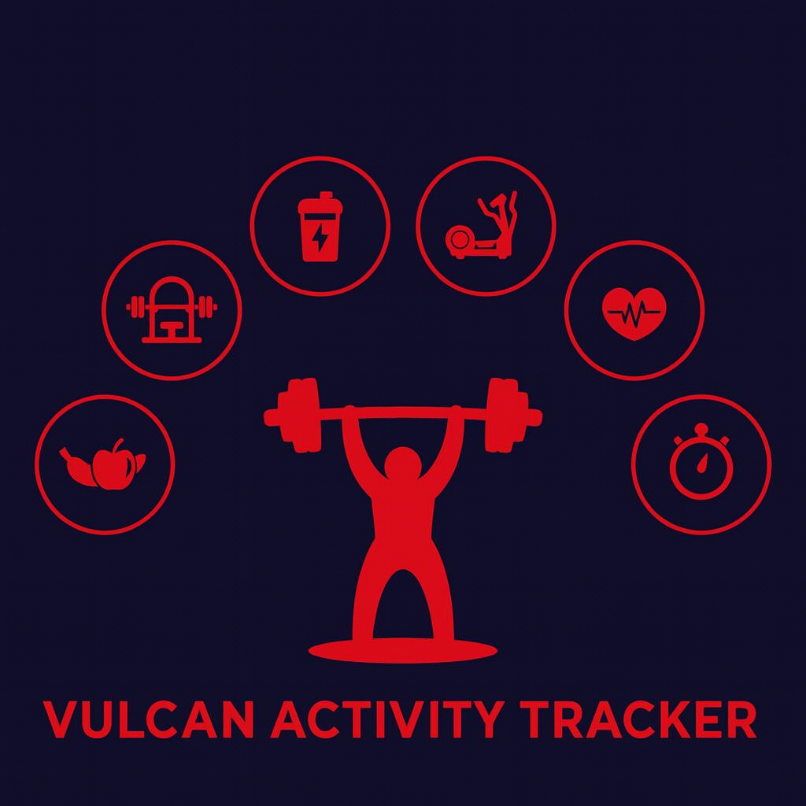

  

  A unified platform for campus athletics, social connection, and goal tracking.

---

<!-- ===================== PROJECT OVERVIEW ===================== -->

<h2>🏃‍♀️ Project Overview</h2>

The <strong>Vulcan Activity Tracker</strong> is an athletic and social engagement platform
designed for campus communities.

<ul>
  <li>🏋️ Track and log athletic activities</li>
  <li>🏫 Support student organizations and clubs</li>
  <li>💬 Encourage social interaction</li>
  <li>🎯 Plan and achieve fitness goals</li>
</ul>

<strong>All in one free, accessible platform built with students in mind.</strong>

---

<!-- ===================== QUICK LINKS ===================== -->

<h2>📌 Quick Links</h2>

  

    <h3>📚 Tutorial</h3>
    
How to navigate and use the Vulcan platform.

    <a href="tutorial">Open →</a>
  

  

    <h3>📆 Weekly Progress</h3>
    
Development updates and milestone tracking.

    <a href="progress/index">View →</a>
  

  

    <h3>📊 Gantt Chart</h3>
    
Project timeline and planning overview.

    <a href="progress/gantt">Explore →</a>
  

  

    <h3>📊 Documents</h3>
    
Project planning and implementaion documents.

    <a href="progress/vulcandocs/documents.html">Explore →</a>
  

  

    <h3>Vulcan Activity Tracker</h3>
    
Live Web Based Application

    <a href="https://vulcanactivitytracker.onrender.com">Live →</a>
  

<!-- ===================== TEAM MEMBERS ===================== -->

<h2>👥 Team Members 🏋️🔥</h2>

  

    🟢 
    <strong>Margo Bonal</strong>
  

  

    🟡 
    <strong>John Gerega</strong>
  

  

    🔵 
    <strong>Luke Ruffing</strong>
  

---

<!-- ===================== ACKNOWLEDGMENTS ===================== -->

<h2>🙌 Acknowledgments</h2>

We would like to thank everyone who contributed directly or indirectly to this project.

<ul>
  <li>🙏 <strong>Mentors</strong> — guidance and technical insight</li>
  <li>💬 <strong>Peers</strong> — feedback, testing, and encouragement</li>
</ul>

💖 Your support helped shape this project into something we’re proud of!

---

🔥 <strong>Let’s make Vulcan Activity Tracker awesome!</strong> 🔥

