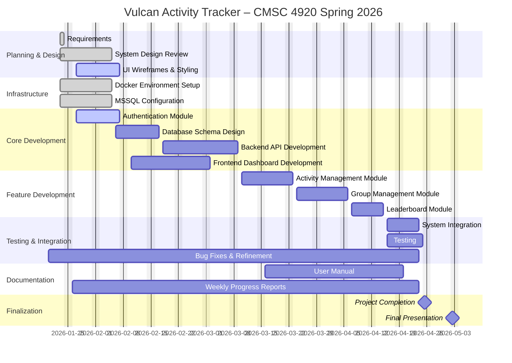

```mermaid
gantt
  title Vulcan Activity Tracker – CMSC 4920 Spring 2026
  dateFormat YYYY-MM-DD
  excludes weekends

  section Planning & Design
  Requirements :done, req, 2026-01-23, 2026-01-24
  System Design Review :done, des, 2026-01-23, 2026-02-05
  UI Wireframes & Styling :active, ui, 2026-01-27, 2026-02-07

  section Infrastructure
  Docker Environment Setup :done, dock, 2026-01-23, 2026-02-05
  MSSQL Configuration :done, dbconf, 2026-01-23, 2026-02-05

  section Core Development
  Authentication Module :active, auth, 2026-01-27, 2026-02-07
  Database Schema Design :db, 2026-02-06, 2026-02-17
  Backend API Development :api, 2026-02-18, 2026-03-09
  Frontend Dashboard Development :front, 2026-02-10, 2026-03-02

  section Feature Development
  Activity Management Module :act, 2026-03-10, 2026-03-23
  Group Management Module :group, 2026-03-24, 2026-04-06
  Leaderboard Module :lead, 2026-04-07, 2026-04-15

  section Testing & Integration
  System Integration :int, 2026-04-16, 2026-04-24
  Testing :test, 2026-04-16, 2026-04-25
  Bug Fixes & Refinement :fix, 2026-01-20, 2026-04-24

  section Documentation
  User Manual :manual, 2026-03-16, 2026-04-20
  Weekly Progress Reports :reports, 2026-01-26, 2026-04-24

  section Finalization
  Project Completion :milestone, complete, 2026-04-24, 1d
  Final Presentation :milestone, pres, 2026-05-01, 1d
```
