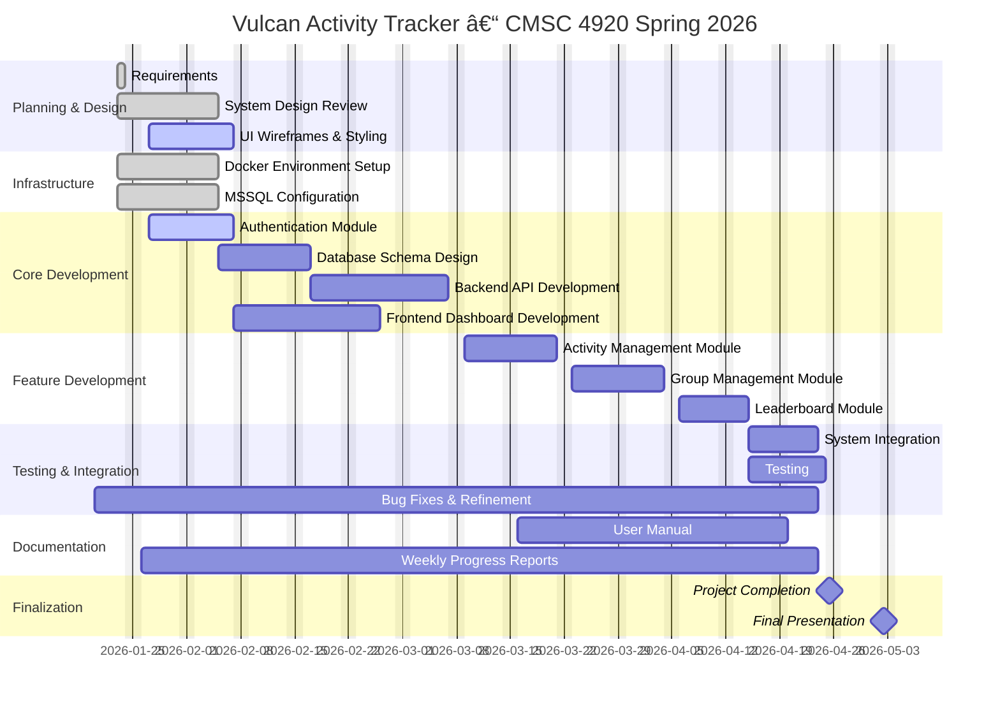

```mermaid
gantt
  title Vulcan Activity Tracker – CMSC 4920 Spring 2026
  dateFormat YYYY-MM-DD
  excludes weekends

  section Planning & Design
  Requirements   :done, req, 2026-01-23, 2026-01-24
  System Design Review   :done, des, 2026-01-23, 2026-02-05
  UI Wireframes & Styling           :active, ui, 2026-01-27, 2026-02-07

  section Infrastructure
  Docker Environment Setup          :done, dock, 2026-01-23, 2026-02-05
  MSSQL Configuration :done, dbconf, 2026-01-23, 2026-02-05

  section Core Development
  Authentication Module             :active, auth, 2026-01-27, 2026-02-07
  Database Schema Design            :db, after dbconf, 8d
  Backend API Development           :api, after db, 14d
  Frontend Dashboard Development    :front, after ui, 14d

  section Feature Development
  Activity Management Module        :act, after api, 10d
  Group Management Module           :group, after act, 10d
  Leaderboard Module                :lead, after group, 7d

  section Testing & Integration
  System Integration                :int, after lead, 7d
  Testing        :test, after lead, 2026-04-25
  Bug Fixes & Refinement             :fix, 2026-01-20, 2026-04-24

  section Documentation
  User Manual                       :manual, 2026-03-16, 2026-04-20
  Weekly Progress Reports           :reports, 2026-01-26, 2026-04-24

  section Finalization
  Project Completion                :milestone, complete, 2026-04-24, 1d
  Final Presentation                :milestone, pres, 2026-05-01, 1d
```
